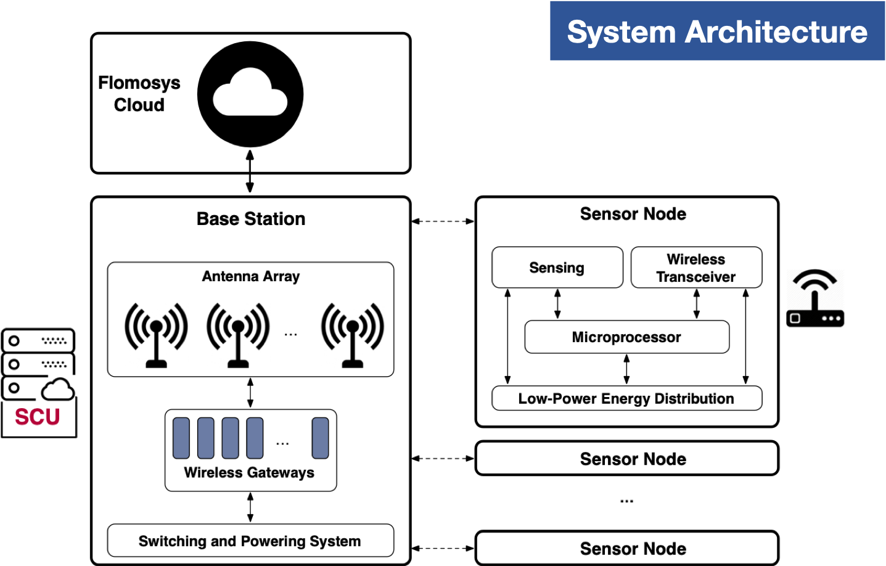

# Flomosys - The (Flo)od (Mo)nitoring (Sys)tem for Santa Clara Valley

 

####  Internet of Things Research Lab
####  Department of Computer Engineering
####  Santa Clara University

 

## Introduction
In 2017, San Jose suffered a flooding of the Coyote Creek which amounted to around $100 million in damage and displaced 14,000 residents.
In response, this project is a low-cost flood-monitoring solution which uses an ultrasonic sensor to sample water levels and send telemetries to the cloud.

## Project Requirements
For Flomosys to offer any value, it must be:

- Reliable
- Low Power
- Low Cost
- Wireless
- Waterproof

Sensor Nodes should use so little power they can survive on solar power only, and should be waterproof given their proximity to moisture

## System Overview

Below is a high-level system architecture diagram.

## Implementation

Our implementation of the Base Station is an array of Raspberry Pi 3s, connected to Lora antennas and an Ethernet cable. 
They are powered over PoE by a bare metal provisioned switch which can be used to remotely trigger a reboot in the event of a catastrophic system failure.
The Base Station is installed at Santa Clara University on the roof of the Swig building, as it is gives us enough height for the antennas.

## Repo Organization
The following folders contain the code for the various system elements:

    node
    cloud
    base
The `base` folder contains the code for the Raspberry Pis, which connects to the antennas and forwards LoRa payloads to the cloud, written in C++.

The `cloud` folder contains two subfolders, `cloud/endpoint` and `cloud/web`.
`endpoint` is the processing code for the cloud server, written in Go, and `web` contains the static html/css/javascript files to retrieve and display data.

The `node` folder contains the Arduino code that runs on the sensor.

# Node Provisioning

The code for the Sensor Node can be opened in the Arduino IDE and uploaded to the Sensor Node over an FTDI serial connection.
Flomosys makes use of several plugins to reduce power usage and to interface with the LoRa antenna, such as the [Low Power](www.rocketscream.com) library by Rocket Scream Electronics, the Arduino and the [RadioHead](https://github.com/hallard/RadioHead) library.

Before compiling the Arduino code for the Sensor node, please make sure these libraries are installed, and put a copy of the RadioHead library into the lib folder.

# Cloud Deployment

The `web` folder's contents should be put in the root directory of a webserver such as Nginx.

Set up a proxy_pass directive in the webserver's config file using the same port used in the endpoint.

First, set you APIKEY Environment Variable, then run the following command to build the binary:

    go build -ldflags "-X main.APIKEY=$APIKEY"

# Base Provisioning

The base code can be compiled and run on the Raspberry Pi using the provided Makefile. 
However, be sure to include an API Key inside the security file so that it can communicate with the Endpoint.
Also note that the binary must be run as root, as it communicates with the LoRa antennas using the GPIO pins.

In order to compile and run the Base Station's binary, you'll need to use the BCM library to interface with the GPIO pins. 
Please note that this may also make cross-compiling difficult.
If you do not already have the BCM libraries installed on the Raspberry Pi, you can get them from Mike McCauley's site [here.](https://www.airspayce.com/mikem/bcm2835/)

## Liscensing 

All code is liscensed under the GPLv2 Liscense. Note that some plugins and libraries may themselves bundle different liscenses, but SIOTLAB nor any of its members past or present are responsible for maintaining or providing support for these libraries.

## Contributors

- Behnam Dezfouli
- Tai Groot
- Peter Ferguson
- Chelsey Li
- Salma Magid
- Jay Sheth
- Francesco Petrini
- JB Anderson
- Navid Shaghagi
- Zach Cameron
- Silvia Figueira
- Allan Baez Morales
